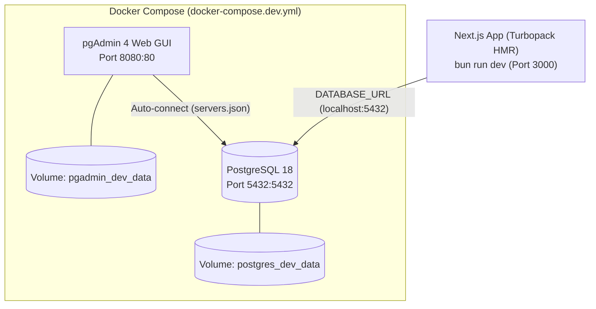
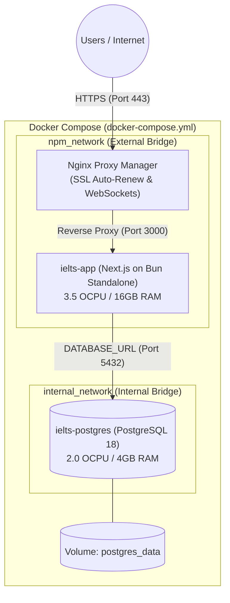

# IELTS Learning & Assessment Platform

Nền tảng Chấm chữa IELTS Speaking & Writing với kiến trúc Domain-Driven Design (DDD), Modular Monolith trên Next.js App Router (Bun Runtime), Drizzle ORM, Google Gemini AI và mô hình Feedback Loop (_"AI assists. Teacher decides."_).

---

## Hướng dẫn Phát triển ở Local (Development Workflow)

Để phát triển ở local với tốc độ HMR cao nhất và **hoàn toàn không ảnh hưởng tới file `docker-compose.yml` của môi trường Production**, dự án tách riêng môi trường development:



### 1. Chuẩn bị biến môi trường local

```bash
cp .env.local.example .env.local
```

### 2. Khởi động PostgreSQL & pgAdmin (Local Dev Containers)

Khởi động PostgreSQL 18 và giao diện quản trị pgAdmin 4:

```bash
docker compose -f docker-compose.dev.yml up -d
```

- **PostgreSQL**: Sẵn sàng tại `localhost:5432` (`user: postgres`, `password: postgres`, `db: ielts_platform`). Volume dữ liệu dev: `postgres_dev_data`.
- **pgAdmin 4**: Truy cập tại **[http://localhost:8080](http://localhost:8080)**:
  - Email: `admin@admin.com`
  - Mật khẩu: `admin`
  - _Lưu ý_: pgAdmin đã được cấu hình tự động nhận diện server `IELTS Local Postgres` qua file `pgadmin/servers.json`.

### 3. Chạy ứng dụng Next.js trên máy Host

Chạy ứng dụng với Bun để nhận được Hot Module Replacement (Turbopack) tức thì:

```bash
bun install
bun run dev
```

Mở trình duyệt tại **[http://localhost:3000](http://localhost:3000)**.

### 4. Dừng môi trường Local DB

Khi không làm việc:

```bash
# Dừng container
docker compose -f docker-compose.dev.yml stop

# Hoặc dừng và xóa container (giữ nguyên volume data)
docker compose -f docker-compose.dev.yml down
```

---

## Triển khai Production (Oracle Cloud VM ARM64 & NPM)

Môi trường Production sử dụng file gốc `docker-compose.yml`:

- Đóng gói toàn bộ Next.js App (Standalone trên `oven/bun:1-alpine`) và PostgreSQL 18.
- Kết nối vào external network `npm_network` do **Nginx Proxy Manager** điều phối SSL Let's Encrypt và WebSocket support.
- Xem chi tiết tại: [`docs/deployment/oracle-cloud-docker-npm.md`](docs/deployment/oracle-cloud-docker-npm.md).



### Lệnh triển khai:

```bash
# Triển khai production trên máy chủ VM
docker compose up -d --build
```
