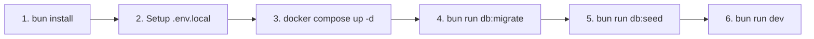

# IELTS Learning & Assessment Platform

Nền tảng Luyện thi & Chấm chữa IELTS thông minh (IELTS Speaking & Writing) theo kiến trúc **Domain-Driven Design (DDD)**, **Modular Monolith** trên nền tảng **Next.js 16 App Router**, **Bun Runtime**, **Drizzle ORM**, **Better Auth**, **Google Gemini AI** và triết lý chấm chữa cộng tác (_"AI assists. Teacher decides."_).

---

## 📋 Yêu cầu Cài đặt Tiên quyết (Prerequisites)

Trước khi bắt đầu, đảm bảo máy tính của bạn đã cài đặt các công cụ sau:

- **[Bun](https://bun.sh/)** `>= 1.1.0` (Trình quản lý package và runtime chính của dự án).
  ```bash
  curl -fsSL https://bun.sh/install | bash
  ```
- **[Docker Desktop](https://www.docker.com/)** hoặc **Docker Engine & Docker Compose** (để chạy PostgreSQL 18, pgAdmin 4 và SeaweedFS S3 Storage ở local).
- **Git**.

---

## 🚀 Hướng dẫn Cài đặt & Khởi động Local (Quick Start)

Quy trình thiết lập môi trường phát triển local hoàn chỉnh gồm **6 bước**:



### Bước 1: Clone Repository & Cài đặt Dependencies

```bash
git clone https://github.com/manh-nd/ielts-learning-platform.git
cd ielts-learning-platform
bun install
```

---

### Bước 2: Thiết lập Biến môi trường Local (`.env.local`)

Sao chép file cấu hình mẫu `.env.example` thành `.env.local`:

```bash
cp .env.example .env.local
```

> [!NOTE]
>
> - Mặc định file `.env.example` đã được cấu hình sẵn chuỗi kết nối chuẩn tới container PostgreSQL, SeaweedFS S3 local và danh sách `TEACHER_EMAILS` cho môi trường development.
> - Để kích hoạt tính năng **Đăng nhập Google OAuth**, xem hướng dẫn chi tiết tại: [`docs/development/google-oauth-setup.md`](docs/development/google-oauth-setup.md).

---

### Bước 3: Khởi động các Dịch vụ Phụ trợ (Docker Compose Dev)

Khởi động PostgreSQL 18, pgAdmin 4 và SeaweedFS S3 local (được cấu hình độc lập trong file `docker-compose.dev.yml` để **không ảnh hưởng** tới môi trường Production):

```bash
docker compose -f docker-compose.dev.yml up -d
```

#### 🌐 Các dịch vụ được khởi chạy:

| Dịch vụ           | Địa chỉ kết nối / Web UI                                                                           | Thông tin đăng nhập mặc định                                 | Mục đích sử dụng                                                  |
| :---------------- | :------------------------------------------------------------------------------------------------- | :----------------------------------------------------------- | :---------------------------------------------------------------- |
| **PostgreSQL 18** | `localhost:5432`                                                                                   | DB: `ielts_platform`<br/>User: `postgres` / Pass: `postgres` | Cơ sở dữ liệu chính (Drizzle ORM & Better Auth)                   |
| **pgAdmin 4**     | **[http://localhost:8080](http://localhost:8080)**                                                 | Email: `admin@admin.com`<br/>Password: `admin`               | Giao diện Web quản trị DB (Đã tự động kết nối qua `servers.json`) |
| **SeaweedFS S3**  | `http://localhost:8333` (S3 API)<br/>**[http://localhost:8888](http://localhost:8888)** (Filer UI) | Access: `any_access_key`<br/>Secret: `any_secret_key`        | Lưu trữ file audio ghi âm IELTS Speaking                          |

---

### Bước 4: Chạy Database Migration (Drizzle ORM)

Khởi tạo cấu trúc bảng (`user`, `session`, `account`, `verification`,...) trong cơ sở dữ liệu PostgreSQL:

```bash
# Áp dụng các file migration SQL có sẵn trong thư mục drizzle/
bun run db:migrate
```

_(Tùy chọn: Trong quá trình phát triển tính năng mới, nếu muốn đẩy trực tiếp thay đổi schema TypeScript vào DB mà chưa cần tạo file migration SQL, bạn có thể dùng lệnh: `bun run db:push`)_.

---

### Bước 5: Seed Dữ liệu Tài khoản Mẫu (Dev Users)

Chạy script seed để tạo sẵn các tài khoản Giáo viên và Học viên phục vụ việc kiểm thử giao diện và phân quyền:

```bash
bun run db:seed
```

#### 🔑 Danh sách Tài khoản Dev Mẫu (Mật khẩu chung: `Password123!`):

| Họ và tên                | Email đăng nhập                           | Vai trò (`role`) | Quyền hạn & Trang đích sau đăng nhập                                   |
| :----------------------- | :---------------------------------------- | :--------------- | :--------------------------------------------------------------------- |
| **IELTS Teacher**        | `teacher@ielts.liuhocngoaingu.com`        | **Giáo viên** 🎓 | Truy cập Không gian Chấm bài (`/teacher/review`)                       |
| **Dual Learner Teacher** | `learnerteacher@ielts.liuhocngoaingu.com` | **Giáo viên** 🎓 | Truy cập Không gian Chấm bài (`/teacher/review`) & Xem trước Dashboard |
| **Teacher Dev**          | `teacher@ielts-prep.vn`                   | **Giáo viên** 🎓 | Truy cập Không gian Chấm bài (`/teacher/review`)                       |
| **Learner Dev**          | `learner@ielts-prep.vn`                   | **Học viên** 📚  | Truy cập Dashboard Luyện thi (`/learner/dashboard`)                    |
| **IELTS Learner**        | `learner@ielts.liuhocngoaingu.com`        | **Học viên** 📚  | Truy cập Dashboard Luyện thi (`/learner/dashboard`)                    |

---

### Bước 6: Khởi động Ứng dụng Next.js

Chạy ứng dụng ở chế độ Development với Turbopack Hot Module Replacement:

```bash
bun run dev
```

Mở trình duyệt và truy cập: **[http://localhost:3000](http://localhost:3000)**.

---

## 🛠️ Hướng dẫn Quản trị Database & Schema Migrations

### 1. Quy trình Cập nhật Schema khi phát triển tính năng mới

Khi bạn thay đổi định nghĩa bảng trong `lib/db/schema.ts` hoặc các schema con trong `modules/*/infrastructure/*-schema.ts`:

1. **Sinh file migration SQL mới**:
   ```bash
   bun run db:generate
   ```
   _Lệnh này sẽ tự động tạo file `.sql` mới trong thư mục `drizzle/`._
2. **Áp dụng migration vào Database**:
   ```bash
   bun run db:migrate
   ```
3. **Cập nhật lại dữ liệu mẫu (nếu cần)**:
   ```bash
   bun run db:seed
   ```

### 2. Reset Toàn bộ Database về Trạng thái Ban đầu (Clean Reset)

Khi muốn xóa sạch dữ liệu cũ và khởi tạo lại toàn bộ từ đầu:

```bash
# 1. Dừng và xóa volume dữ liệu Docker
docker compose -f docker-compose.dev.yml down -v

# 2. Khởi động lại container PostgreSQL sạch
docker compose -f docker-compose.dev.yml up -d

# 3. Chạy migration & seed dữ liệu
bun run db:migrate
bun run db:seed
```

---

## 🧪 Kiểm thử Tự động (Automated Testing)

Dự án thiết lập chiến lược kiểm thử đa tầng kết hợp **Bun Unit Test Runner**, **Playwright E2E** và **Storybook**:

```bash
# 1. Chạy toàn bộ Unit & Integration Tests (84 tests - ~0.2s)
bun run test

# 2. Chạy toàn bộ End-to-End Tests với Playwright (20 tests - ~6.9s)
bun run test:e2e

# 3. Chạy E2E Tests với giao diện tương tác trực quan (Playwright Interactive UI)
bun run test:e2e:ui

# 4. Khởi chạy Storybook Component Workshop
bun run storybook

# 5. Chạy Storybook Interaction Tests
bun run test-storybook
```

> [!TIP]
> **Cơ chế E2E Tối ưu**:
>
> - E2E Tests chạy độc lập trên cổng chuyên dụng `PORT=3001` (`bunx next start -p 3001`), không gây xung đột với cổng `3000` của lập trình viên.
> - Flag `ENABLE_E2E_MOCK_AUTH=true` cho phép kiểm thử toàn bộ luồng SSR, Proxy và UI ngay cả khi chưa bật container Database.

---

## 📖 Bảng Tra cứu Lệnh (CLI Scripts Cheat Sheet)

| Lệnh                     | Mô tả                                                                |
| :----------------------- | :------------------------------------------------------------------- |
| `bun run dev`            | Khởi động Next.js App Router ở chế độ Dev (Port 3000, Turbopack)     |
| `bun run build`          | Build ứng dụng Next.js cho môi trường Production                     |
| `bun run start`          | Chạy ứng dụng Next.js sau khi đã build                               |
| `bun run lint`           | Chạy ESLint kiểm tra chất lượng mã nguồn                             |
| `bun run typecheck`      | Chạy TypeScript compiler kiểm tra kiểu tĩnh (`tsc --noEmit`)         |
| `bun run test`           | Chạy bộ Unit & Integration Tests với Bun Test Runner                 |
| `bun run test:e2e`       | Chạy bộ E2E Tests với Playwright (Headless Chromium)                 |
| `bun run test:e2e:ui`    | Mở giao diện Playwright Test Runner để debug trực quan               |
| `bun run db:generate`    | Tạo file SQL Migration mới từ Drizzle Schema                         |
| `bun run db:migrate`     | Chạy các file SQL Migration chưa áp dụng vào Database                |
| `bun run db:push`        | Đẩy trực tiếp Drizzle Schema vào Database (không tạo file migration) |
| `bun run db:seed`        | Khởi tạo / đồng bộ các tài khoản Dev mẫu vào Database                |
| `bun run storybook`      | Khởi chạy Storybook UI Documentation tại `http://localhost:6006`     |
| `bun run test-storybook` | Chạy kiểm thử tự động các Stories trong Storybook                    |

---

## ❓ Xử lý Sự cố Thường gặp (Troubleshooting / FAQ)

### 1. Lỗi `ECONNREFUSED 127.0.0.1:5432` khi đăng nhập hoặc chạy `db:seed`

- **Nguyên nhân**: Container PostgreSQL chưa được khởi động.
- **Khắc phục**: Chạy lệnh `docker compose -f docker-compose.dev.yml up -d` và kiểm tra trạng thái container bằng `docker ps`.

### 2. Lỗi `EADDRINUSE: address already in use :::3000`

- **Nguyên nhân**: Đang có tiến trình khác hoặc một cửa sổ terminal khác chiếm dụng cổng 3000.
- **Khắc phục**:
  ```bash
  # Tìm và tắt tiến trình đang chiếm cổng 3000 trên macOS/Linux:
  lsof -ti :3000 | xargs kill -9
  ```

### 3. Tắt môi trường Dev khi không làm việc

```bash
# Dừng container nhưng giữ nguyên dữ liệu đã seed trong volume:
docker compose -f docker-compose.dev.yml stop

# Xóa container khi cần giải phóng tài nguyên:
docker compose -f docker-compose.dev.yml down
```

---

## 🚢 Triển khai Production (Oracle Cloud VM ARM64 & NPM)

Môi trường Production sử dụng file gốc `docker-compose.yml` (được cách ly hoàn toàn với môi trường dev):

- Đóng gói toàn bộ Next.js App (Standalone trên `oven/bun:1-alpine`) và PostgreSQL 18.
- Kết nối vào external network `npm_network` do **Nginx Proxy Manager** điều phối SSL Let's Encrypt và WebSocket support.
- Xem chi tiết tại: [`docs/deployment/oracle-cloud-docker-npm.md`](docs/deployment/oracle-cloud-docker-npm.md).

```bash
# Lệnh deploy production trên máy chủ:
docker compose up -d --build
```
