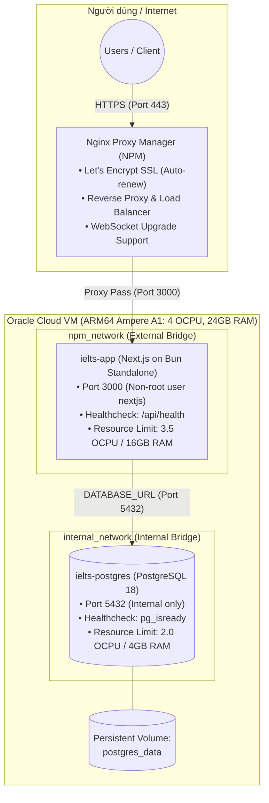

# Hướng dẫn Triển khai Oracle Cloud VM (ARM64) với Docker Compose & Nginx Proxy Manager

Tài liệu này hướng dẫn chi tiết quy trình thiết lập, cấu hình và vận hành Nền tảng IELTS Learning Platform trên máy chủ đám mây **Oracle Cloud Infrastructure (OCI) Ampere A1 (ARM64 - 4 OCPU, 24GB RAM)**, kết nối qua mạng Docker `npm_network` do **Nginx Proxy Manager (NPM)** điều phối reverse proxy, SSL Let's Encrypt và WebSocket.

---

## 1. Tổng quan Kiến trúc Hạ tầng



---

## 2. Chuẩn bị Môi trường Máy chủ (Oracle Cloud VM)

### 2.1. Cấu hình Mạng & Firewall (VCN Security Lists & iptables)

Trên Oracle Cloud Console, mở Ingress Rules cho VCN / Subnet:

- **Port 80** (HTTP - Let's Encrypt ACME Challenge)
- **Port 443** (HTTPS - Traffic chính)
- **Port 81** (NPM Admin Web UI - khuyến nghị giới hạn IP quản trị viên)

Trên máy chủ Ubuntu/Debian (ARM64), mở firewall nội bộ:

```bash
# Cập nhật hệ thống
sudo apt update && sudo apt upgrade -y

# Cấu hình iptables mở các port cần thiết nếu có firewall mặc định của Oracle Linux/Ubuntu
sudo iptables -I INPUT 6 -m state --state NEW -p tcp --dport 80 -j ACCEPT
sudo iptables -I INPUT 6 -m state --state NEW -p tcp --dport 443 -j ACCEPT
sudo iptables -I INPUT 6 -m state --state NEW -p tcp --dport 81 -j ACCEPT
sudo netfilter-persistent save || sudo iptables-save | sudo tee /etc/iptables/rules.v4
```

### 2.2. Cài đặt Docker & Docker Compose Plugin (Hỗ trợ ARM64)

```bash
# Cài đặt Docker Engine chính thức
curl -fsSL https://get.docker.com -o get-docker.sh
sudo sh get-docker.sh

# Phân quyền cho user hiện tại
sudo usermod -aG docker $USER
newgrp docker

# Kiểm tra kiến trúc và phiên bản
docker version
docker compose version
uname -m # Output: aarch64
```

---

## 3. Thiết lập Mạng Chung `npm_network` & Nginx Proxy Manager

### 3.1. Tạo External Docker Network

Tạo một mạng bridge độc lập để Nginx Proxy Manager kết nối tới tất cả các container dịch vụ:

```bash
docker network create npm_network
```

### 3.2. Cài đặt Nginx Proxy Manager (nếu chưa có)

Tạo thư mục `~/nginx-proxy-manager` với file `docker-compose.yml`:

```yaml
services:
  npm:
    image: "jc21/nginx-proxy-manager:latest"
    container_name: nginx-proxy-manager
    restart: unless-stopped
    ports:
      - "80:80"
      - "81:81"
      - "443:443"
    volumes:
      - ./data:/data
      - ./letsencrypt:/etc/letsencrypt
    networks:
      - npm_network

networks:
  npm_network:
    external: true
```

Khởi chạy NPM:

```bash
cd ~/nginx-proxy-manager
docker compose up -d
```

Truy cập `http://<IP_ORACLE_VM>:81` để cấu hình tài khoản ban đầu (Mặc định: `admin@example.com` / `changeme`).

---

## 4. Triển khai IELTS Learning Platform

### 4.1. Clone Code & Thiết lập Biến Môi trường

```bash
# Clone repository
git clone <REPO_URL> /opt/ielts-learning-platform
cd /opt/ielts-learning-platform

# Tạo file biến môi trường production
cp .env.example .env.production
nano .env.production
```

Cập nhật các giá trị bí mật:

- `POSTGRES_PASSWORD`: Mật khẩu bảo mật cho database.
- `BETTER_AUTH_SECRET`: Sinh chuỗi 32 ký tự ngẫu nhiên bằng `openssl rand -base64 32`.
- `BETTER_AUTH_URL`: Domain chính thức, ví dụ `https://ielts.yourdomain.com`.
- `GOOGLE_CLIENT_ID` / `GOOGLE_CLIENT_SECRET`: Khóa Google OAuth (Authorized Redirect URI: `https://ielts.yourdomain.com/api/auth/callback/google`).
- `GEMINI_API_KEY` / `GEMINI_API_KEYS`: Khóa Google Gemini API.
- `R2_*`: Thông tin Cloudflare R2 bucket lưu trữ audio Speaking.

### 4.2. Build & Khởi chạy Containers

```bash
# Build và chạy ngầm
docker compose up -d --build

# Kiểm tra trạng thái containers và healthcheck
docker compose ps
```

Kiểm tra log:

```bash
# Log ứng dụng Next.js
docker compose logs -f app

# Log database PostgreSQL
docker compose logs -f postgres
```

### 4.3. Chạy Migration Database

Khi container `app` đã sẵn sàng và `postgres` đã healthy:

```bash
# Chạy migration Drizzle ORM
docker compose exec app bun run db:migrate # (hoặc lệnh migration tương ứng)
```

---

## 5. Cấu hình Reverse Proxy & SSL trên Nginx Proxy Manager

Đăng nhập vào giao diện Web NPM (`http://<IP_ORACLE_VM>:81`) và thực hiện các bước sau:

### 5.1. Thêm Proxy Host Mới (Tab "Details")

- **Domain Names**: `ielts.yourdomain.com` (và `www.ielts.yourdomain.com` nếu có)
- **Scheme**: `http`
- **Forward Hostname / IP**: `ielts-app` (Tên container dịch vụ trong mạng `npm_network`)
- **Forward Port**: `3000`
- **Cache Assets**: Bật (Optional, giúp tối ưu cache static assets)
- **Block Common Exploits**: Bật (Khuyến nghị bảo mật)
- **Websockets Support**: **BẬT (ON)** (Bắt buộc cho Gemini Live API, streaming audio và Server-Sent Events)

### 5.2. Cấu hình SSL Certificate (Tab "SSL")

- **SSL Certificate**: `Request a new SSL Certificate`
- **Force SSL**: Bật
- **HTTP/2 Support**: Bật
- **HSTS Enabled**: Bật
- **HSTS Subdomains**: Tùy chọn
- **I Agree to the Let's Encrypt Terms of Service**: Bật
- Nhập email nhận thông báo gia hạn chứng chỉ SSL tự động.

### 5.3. Tối ưu Nâng cao cho Audio & Long Requests (Tab "Advanced")

Trong tab **Advanced**, dán đoạn cấu hình Nginx sau để xử lý các file ghi âm bài Speaking lớn (lên tới 50MB) và tránh timeout khi AI chấm bài:

```nginx
# Cho phép upload file ghi âm Speaking dung lượng lớn
client_max_body_size 50M;

# Tăng timeout cho các tác vụ xử lý AI và Live WebSocket streaming
proxy_read_timeout 300s;
proxy_send_timeout 300s;
proxy_connect_timeout 60s;

# WebSocket Headers (đảm bảo tương thích đầy đủ với Gemini Live Audio stream)
proxy_set_header Upgrade $http_upgrade;
proxy_set_header Connection "upgrade";
proxy_set_header Host $host;
proxy_set_header X-Real-IP $remote_addr;
proxy_set_header X-Forwarded-For $proxy_add_x_forwarded_for;
proxy_set_header X-Forwarded-Proto $scheme;
```

Bấm **Save** để áp dụng.

---

## 6. Vận hành, Giám sát & Sao lưu

### 6.1. Kiểm tra Health Check

Endpoint kiểm tra sức khỏe của Next.js:

```bash
curl -I https://ielts.yourdomain.com/api/health
# HTTP/2 200 OK
```

### 6.2. Sao lưu Cơ sở Dữ liệu Định kỳ (Automated Backup)

Tạo cron job sao lưu PostgreSQL tự động mỗi ngày vào 02:00 sáng:

```bash
# Tạo script backup ~/backup-ielts-db.sh
cat << 'EOF' > ~/backup-ielts-db.sh
#!/bin/bash
BACKUP_DIR="/opt/backups/postgres"
mkdir -p $BACKUP_DIR
TIMESTAMP=$(date +"%Y%m%d_%H%M%S")
docker exec -t ielts-postgres pg_dump -U postgres ielts_platform | gzip > "$BACKUP_DIR/ielts_db_$TIMESTAMP.sql.gz"
# Giữ bản sao lưu trong vòng 30 ngày
find $BACKUP_DIR -type f -name "*.sql.gz" -mtime +30 -delete
EOF

chmod +x ~/backup-ielts-db.sh

# Thêm vào crontab
(crontab -l 2>/dev/null; echo "0 2 * * * /home/ubuntu/backup-ielts-db.sh") | crontab -
```

### 6.3. Cập nhật Phiên bản Ứng dụng (Zero-downtime Rollout)

```bash
cd /opt/ielts-learning-platform
git pull origin main
docker compose build app
docker compose up -d --no-deps app
```
