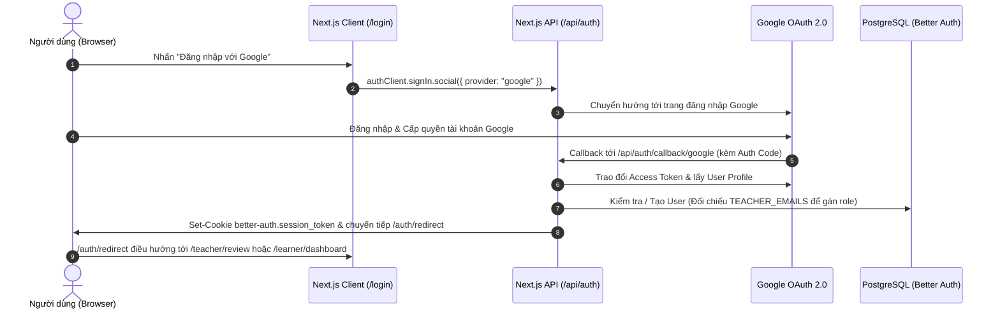

# Hướng dẫn Cấu hình & Tích hợp Google OAuth (Better Auth)

Tài liệu này hướng dẫn chi tiết từng bước để tạo Google OAuth Client ID trên **Google Cloud Console**, cấu hình biến môi trường và kích hoạt luồng đăng nhập/đăng ký bằng tài khoản Google cho cả môi trường **Local Development** và **Production**.

---

## 1. Tổng quan Kiến trúc Xác thực Google OAuth



---

## 2. Các Bước Tạo Khóa Google OAuth trên Google Cloud Console

### Bước 1: Tạo hoặc Chọn Project trên Google Cloud

1. Truy cập vào **[Google Cloud Console](https://console.cloud.google.com/)**.
2. Đăng nhập bằng tài khoản Google của bạn.
3. Ở thanh điều hướng trên cùng, nhấn vào menu chọn Project và nhấn **"New Project"** (Tạo dự án mới).
4. Đặt tên dự án (ví dụ: `ielts-learning-platform`) và nhấn **"Create"**.

---

### Bước 2: Cấu hình OAuth Consent Screen (Màn hình Chấp thuận)

1. Trong menu bên trái, vào **APIs & Services** ➔ **OAuth consent screen** (hoặc truy cập trực tiếp [tại đây](https://console.cloud.google.com/apis/credentials/consent)).
2. Chọn **User Type**:
   - Chọn **External** (để bất kỳ tài khoản Google nào cũng có thể đăng nhập).
   - Nhấn **Create**.
3. Điền thông tin ứng dụng cơ bản (**App information**):
   - **App name**: `IELTS Master Platform`
   - **User support email**: Chọn email của bạn.
   - **Developer contact information**: Nhập email của bạn.
   - Nhấn **Save and Continue**.
4. **Scopes (Phạm vi truy cập)**:
   - Nhấn **Add or Remove Scopes**.
   - Chọn 2 scope cơ bản:
     - `.../auth/userinfo.email`
     - `.../auth/userinfo.profile`
     - `openid`
   - Nhấn **Update** ➔ **Save and Continue**.
5. **Test users (Người dùng thử nghiệm)** _(Khi ứng dụng ở trạng thái Testing)_:
   - Nhấn **Add Users** và thêm các email Google bạn sẽ dùng để test đăng nhập (ví dụ: `teacher@ielts.liuhocngoaingu.com` hoặc email cá nhân của bạn).
   - Nhấn **Save and Continue** ➔ **Back to Dashboard**.

---

### Bước 3: Tạo OAuth 2.0 Client ID Credentials

1. Trong menu bên trái, vào **APIs & Services** ➔ **Credentials** (hoặc truy cập [tại đây](https://console.cloud.google.com/apis/credentials)).
2. Nhấn vào nút **"+ CREATE CREDENTIALS"** ở trên cùng ➔ Chọn **"OAuth client ID"**.
3. Chọn **Application type**: **Web application**.
4. Đặt tên: `IELTS Master Web Client`.
5. Cấu hình **Authorized JavaScript origins** (Nguồn gốc JavaScript được ủy quyền):
   - Môi trường Local:
     ```text
     http://localhost:3000
     ```
   - Môi trường Production (nếu có):
     ```text
     https://ielts.yourdomain.com
     ```
6. Cấu hình **Authorized redirect URIs** (URI chuyển hướng được ủy quyền - **Rất quan trọng**):
   - Môi trường Local:
     ```text
     http://localhost:3000/api/auth/callback/google
     ```
   - Môi trường Production:
     ```text
     https://ielts.yourdomain.com/api/auth/callback/google
     ```
7. Nhấn **"CREATE"**.
8. Một cửa sổ popup sẽ xuất hiện chứa:
   - **Client ID** (ví dụ: `1234567890-abcdef.apps.googleusercontent.com`)
   - **Client Secret** (ví dụ: `GOCSPX-abc123xyz_example`)

> [!IMPORTANT]
> Hãy sao chép 2 giá trị `Client ID` và `Client Secret` này để dán vào file cấu hình môi trường ở bước tiếp theo.

---

## 3. Cấu hình Biến Môi trường trong Codebase

Mở file `.env.local` trong thư mục gốc của dự án và dán thông tin Google OAuth:

```ini
# ==============================================================================
# Google OAuth Configuration
# ==============================================================================
GOOGLE_CLIENT_ID=your_client_id_here.apps.googleusercontent.com
GOOGLE_CLIENT_SECRET=GOCSPX-your_client_secret_here

# Địa chỉ URL ứng dụng
BETTER_AUTH_URL=http://localhost:3000
NEXT_PUBLIC_APP_URL=http://localhost:3000

# ==============================================================================
# Phân Quyền Giáo Viên (Bootstrap Role: "teacher")
# ==============================================================================
# Nếu tài khoản Google đăng nhập có email nằm trong danh sách này,
# hệ thống sẽ tự động cấp vai trò Giáo viên ("teacher").
TEACHER_EMAILS=teacher@ielts.liuhocngoaingu.com,learnerteacher@ielts.liuhocngoaingu.com,teacher@ielts-prep.vn,your-teacher-email@gmail.com
```

---

## 4. Kiểm tra Thực tế Luồng Đăng nhập Google OAuth

1. Khởi động PostgreSQL và Next.js dev server:
   ```bash
   docker compose -f docker-compose.dev.yml up -d
   bun run dev
   ```
2. Mở trình duyệt tại **[http://localhost:3000/login](http://localhost:3000/login)** hoặc **[http://localhost:3000/signup](http://localhost:3000/signup)**.
3. Bạn sẽ thấy nút **"Đăng nhập với Google"** / **"Đăng ký với Google"** tự động hiển thị trên giao diện.
4. Nhấn nút ➔ Chọn tài khoản Google ➔ Xác nhận cấp quyền.
5. Hệ thống sẽ tự động:
   - Tạo bản ghi trong bảng `user` và `account` (`provider_id: "google"`).
   - Thiết lập `email_verified: true`.
   - Phân giải vai trò:
     - Nếu email thuộc danh sách `TEACHER_EMAILS` ➔ Điều hướng về `/teacher/review`.
     - Nếu email người dùng bình thường ➔ Điều hướng về `/learner/dashboard`.

---

## 5. Xử lý Sự cố Thường gặp (Troubleshooting)

### 1. Lỗi `redirect_uri_mismatch` (Error 400)

- **Nguyên nhân**: URI callback trong yêu cầu đăng nhập không khớp chính xác với URI đã đăng ký trên Google Cloud Console.
- **Khắc phục**:
  - Kiểm tra xem trong phần **Authorized redirect URIs** của Google Cloud Console đã thêm chính xác:
    `http://localhost:3000/api/auth/callback/google` (lưu ý không có dấu gạch chéo `/` ở cuối cùng).
  - Kiểm tra `BETTER_AUTH_URL` trong `.env.local` có đúng là `http://localhost:3000` hay không.

### 2. Lỗi `Access blocked: Authorization Error` (Error 403)

- **Nguyên nhân**: Ứng dụng đang ở chế độ **Testing** (chưa Publish) và email Google bạn dùng để đăng nhập chưa được thêm vào danh sách **Test Users**.
- **Khắc phục**: Vào Google Cloud Console ➔ **OAuth consent screen** ➔ **Test users** ➔ Nhấn **Add users** và thêm địa chỉ email của bạn.

### 3. Nút Google OAuth bị ẩn trên giao diện

- **Nguyên nhân**: File `.env.local` chưa có giá trị `GOOGLE_CLIENT_ID` hoặc `GOOGLE_CLIENT_SECRET` (hoặc đang để trống).
- **Khắc phục**: Điền đầy đủ 2 biến trong `.env.local` và khởi động lại `bun run dev` để Server Component nạp biến môi trường mới.
