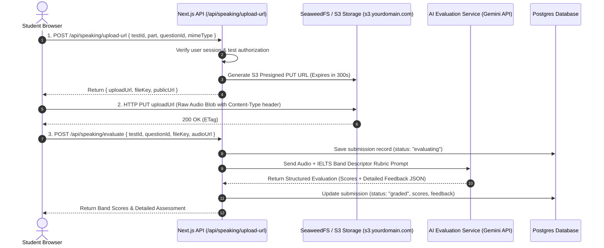

# Research: Audio Pipeline & AI Evaluation Strategy for IELTS Speaking Module

**Ticket:** #3  
**Status:** Completed  
**Target Module:** IELTS Speaking (Part 1, Part 2, Part 3 - Mock Test & Homework)

---

## 1. Browser Audio Recording & Cross-Browser Compatibility

### 1.1 Technology Choice: MediaRecorder vs Web Audio API

For recording user speech in modern web applications, two primary approaches exist:

| Parameter                     | Native MediaRecorder API                        | Web Audio API (AudioWorklet + WASM Encoder)                    |
| :---------------------------- | :---------------------------------------------- | :------------------------------------------------------------- |
| **Implementation Complexity** | Low (Native browser API, minimal code)          | High (Requires custom worklet, WASM ffmpeg/lamejs/opus worker) |
| **CPU / Battery Impact**      | Minimal (Hardware/OS-accelerated encoding)      | Moderate to High (JS/WASM thread encoding)                     |
| **Cross-Browser Support**     | Universal (Chrome, Edge, Firefox, Safari 14.1+) | Universal (but heavy bundle size +200-500KB)                   |
| **Output Formats**            | WebM (Opus), MP4 (AAC), OGG                     | Any (WAV, MP3, Opus via WASM)                                  |
| **Recommendation for MVP**    | **Recommended (Native MediaRecorder)**          | Phase 2 fallback only if legacy support is required            |

### 1.2 MIME Type Compatibility & Format Fallback Matrix

Safari and Chromium historically supported different audio containers. As of Safari 18.4 (2025/2026), Safari supports `audio/webm;codecs=opus`, but legacy iOS versions (iOS 15–18.3) require `audio/mp4`.

```typescript
/**
 * Dynamic MIME type detection for MediaRecorder
 * Priority: WebM (Opus) -> MP4 (AAC) -> OGG (Opus) -> Default
 */
export function getSupportedAudioMimeType(): string {
  const candidateTypes = [
    "audio/webm;codecs=opus",
    "audio/webm",
    "audio/mp4;codecs=aac",
    "audio/mp4",
    "audio/ogg;codecs=opus",
    "audio/wav",
  ];

  for (const type of candidateTypes) {
    if (
      typeof MediaRecorder !== "undefined" &&
      MediaRecorder.isTypeSupported(type)
    ) {
      return type;
    }
  }

  return ""; // Browser default
}
```

#### Format Characteristics Comparison

| Container / Codec | Typical Bitrate | Audio Quality for Voice                 | File Size (1 min speech) | Gemini Multimodal Support | Whisper STT Support |
| :---------------- | :-------------- | :-------------------------------------- | :----------------------- | :------------------------ | :------------------ |
| **WebM / Opus**   | 24–32 kbps      | Excellent (Industry standard for voice) | ~200 – 250 KB            | Native (`audio/webm`)     | Native              |
| **MP4 / AAC**     | 32–64 kbps      | Very Good                               | ~300 – 500 KB            | Native (`audio/mp4`)      | Native              |
| **WAV / PCM**     | 256–768 kbps    | Uncompressed Lossless                   | ~3.5 – 6.0 MB            | Native (`audio/wav`)      | Native              |

> [!TIP]
> Both WebM/Opus and MP4/AAC achieve 10x-20x compression over uncompressed WAV with zero perceptible degradation for speech evaluation models, dramatically speeding up client upload times.

### 1.3 Recommended Audio Constraints

When calling `navigator.mediaDevices.getUserMedia()`, specify voice-optimized audio constraints:

```typescript
export const IELTS_AUDIO_CONSTRAINTS: MediaStreamConstraints = {
  audio: {
    channelCount: 1, // Mono: Halves file size without speech quality loss
    sampleRate: 16000, // 16kHz: Standard speech recognition sampling rate
    echoCancellation: true, // Removes examiner TTS playback echo from speakers
    noiseSuppression: true, // Filters steady background hiss / fan noise
    autoGainControl: true, // Normalizes soft and loud speakers
  },
  video: false,
};
```

### 1.4 IELTS Speaking User Experience (UX) Flow by Part

To match official IELTS test formats while minimizing network risks:

1. **Part 1 (Introduction & Interview - 4 to 5 minutes):**
   - **Structure:** 3–4 questions across 2–3 everyday topics.
   - **UX:** Examiner AI / TTS plays Question 1 $\rightarrow$ Student speaks (20–40s) $\rightarrow$ Student clicks "Next Question" (or auto-stops after 45s) $\rightarrow$ Audio uploaded in background per question.
2. **Part 2 (Individual Long Turn / Cue Card - 3 to 4 minutes):**
   - **Structure:** 1 Cue Card prompt with 4 bullet points.
   - **UX:** 1-minute digital preparation countdown (with scratchpad for notes) $\rightarrow$ 2-minute mandatory uninterrupted recording with visual progress bar $\rightarrow$ Auto-finish at 2:00.
3. **Part 3 (Two-way Discussion - 4 to 5 minutes):**
   - **Structure:** Abstract questions extending Part 2 theme.
   - **UX:** Question-by-question turn-taking (40–60s per answer).

---

## 2. Audio Storage & Upload Architecture

### 2.1 Storage Strategy: Self-Hosted SeaweedFS on VM (MVP) to Cloudflare R2 / AWS S3 (ADR-0003)

| Feature / Metric           | Self-Hosted SeaweedFS (Oracle Cloud VM)     | Cloudflare R2 (Phase 2 Cloud Migration)   | AWS S3 (Standard)             |
| :------------------------- | :------------------------------------------ | :---------------------------------------- | :---------------------------- |
| **Storage Cost**           | **$0.00** (Included in VM Block Volume)     | **$0.015 / GB / month** (10 GB free)      | $0.023 / GB / month           |
| **Data Egress (Download)** | **$0.00 / GB** (Free internal/VM egress)    | **$0.00 / GB (Free Egress)**              | **~$0.09 / GB** (Expensive)   |
| **License**                | **Apache 2.0** (Open & Commercial friendly) | Managed Cloud                             | Managed Cloud                 |
| **RAM Footprint**          | **~100MB - 150MB RAM** (Ultra-lightweight)  | **0 MB RAM** on VM                        | **0 MB RAM** on VM            |
| **S3 API Compatibility**   | 100% S3-compatible (`@aws-sdk/client-s3`)   | 100% S3-compatible (`@aws-sdk/client-s3`) | Native                        |
| **Presigned URL Flow**     | Native S3 Presigned PUT / GET               | Native S3 Presigned PUT / GET             | Native S3 Presigned PUT / GET |

> [!IMPORTANT]
> **MVP Decision (ADR-0003):** To minimize initial external dependencies, eliminate third-party cloud friction, and avoid MinIO's AGPLv3/Docker Hub distribution changes, MVP uses **SeaweedFS** (`chrislusf/seaweedfs`) deployed directly on the Oracle Cloud VM disk via Docker Compose.
> Because the application code interfaces through `@aws-sdk/client-s3` and `@aws-sdk/s3-request-presigner`, upgrading to **Cloudflare R2** in Phase 2 requires **zero code changes** — only swapping environment variables (`S3_ENDPOINT`, `S3_ACCESS_KEY_ID`, `S3_SECRET_ACCESS_KEY`, `S3_BUCKET_NAME`).

### 2.2 Direct-to-Storage Presigned Upload Architecture



### 2.3 Storage Key Structure & Lifecycle Policy

```
audio/
  speaking/
    users/{userId}/
      sessions/{sessionId}/
        part1_q1_{timestamp}.webm
        part1_q2_{timestamp}.webm
        part2_longturn_{timestamp}.webm
        part3_q1_{timestamp}.webm
```

- **Retention Rules:**
  - Mock Tests: Retain raw audio for 60 days, then auto-delete or archive (transcripts & JSON scores kept forever in DB).
  - Homework: Retain audio until teacher completes review + 180 days for training dataset collection.

---

## 3. AI Evaluation: Multimodal LLM vs Multi-Stage STT Pipeline

### 3.1 Comparison of Architectural Paradigms

```
Option A: Single-Stage Multimodal LLM (Gemini 2.5 / 3.7 Flash)
[Audio File] ───────────────► [Gemini Flash Multimodal] ───────────────► [Structured IELTS Result]
                               (Audio Acoustic + Text in 1 step)

Option B: Multi-Stage STT + Phoneme + Text LLM
[Audio File] ────┬──────────► [Whisper STT] ────────► [Text Transcript] ──┐
                 │                                                        ├─► [Text LLM] ──► [Final Result]
                 └──────────► [Azure Speech API] ──► [Phoneme IPA Score] ─┘
```

| Criteria                   | Option A: Gemini Multimodal Audio                          | Option B: Whisper + Azure Pronunciation + LLM         | Option C: Groq Whisper + Gemini Text           |
| :------------------------- | :--------------------------------------------------------- | :---------------------------------------------------- | :--------------------------------------------- |
| **Model / Services**       | Gemini 2.5/3.7 Flash                                       | OpenAI Whisper + Azure Speech + Claude/GPT-4o         | Groq Whisper-large-v3 + Gemini Flash           |
| **Acoustic Understanding** | **Native** (hears tone, pause length, intonation, cadence) | Azure provides phoneme IPA; LLM only gets text        | **Zero acoustic** (pure text transcription)    |
| **Pronunciation Accuracy** | High for IELTS rhythm, stress, intonation, accent          | Very High for phoneme-level IPA mismatch              | Poor (Cannot evaluate pronunciation from text) |
| **STT Masking Problem**    | **None** (Listens to raw audio)                            | High (Whisper autocorrects bad grammar/pronunciation) | High                                           |
| **End-to-End Latency**     | **2.5 – 4.5 seconds**                                      | 6.0 – 9.0 seconds (3 serial API calls)                | 2.0 – 3.5 seconds                              |
| **Cost per 15-min Test**   | **~$0.02 – $0.03**                                         | ~$0.15 – $0.25                                        | ~$0.01 (but no true PR score)                  |
| **Implementation Effort**  | **1–2 days (1 unified API)**                               | 1–2 weeks (Complex multi-API orchestration)           | 3–4 days                                       |
| **MVP Recommendation**     | ⭐ **STRONGLY RECOMMENDED**                                | ⭐ **Phase 2 Expansion**                              | Not recommended for Speaking                   |

### 3.2 The Critical "STT Masking" Dilemma in IELTS

When using standard Speech-to-Text (Whisper/Google STT) before an LLM:

1. **Grammar Masking:** If a student says _"She go to school yesterday"_, Whisper frequently transcribes _"She went to school yesterday"_ or _"She goes to school yesterday"_ due to language model priors. The downstream LLM awards higher Grammatical Range & Accuracy than deserved.
2. **Pronunciation Masking:** If a student mispronounces _"desert"_ as _"dessert"_ or drops final consonants (_"think"_ pronounced as _"tin"_), STT either guesses the intended word or produces a nonsensical transcript, confounding Lexical Resource with Pronunciation.
3. **Fluency Loss:** Standard transcripts strip out micro-pauses (e.g. 2.5-second hesitation searching for vocabulary vs normal natural pause), making Fluency scoring inaccurate without complex timestamp math.

**Gemini Multimodal Audio directly receives audio tokens (32 tokens/sec)**, allowing it to detect:

- Hesitation pauses vs natural breath pauses.
- Intonation patterns (rising for uncertainty, flat robotic cadence).
- Word stress errors (e.g., _phoTOgraphy_ vs _PHOtograph_).
- Dropped consonant endings common in Vietnamese speakers (/s/, /t/, /d/, /θ/).

---

## 4. IELTS 4-Criteria Scoring Calibration & Prompt Engineering

### 4.1 Official Band Descriptors Mapping

```
                                  IELTS SPEAKING (0.0 - 9.0)
                                              │
    ┌─────────────────────────┬───────────────┴───────────────┬─────────────────────────┐
    ▼                         ▼                               ▼                         ▼
Fluency & Coherence       Lexical Resource       Grammatical Range & Accuracy      Pronunciation
• Speech rate (WPM)       • Lexical diversity     • Simple vs Complex mix           • Phoneme precision
• Pausing & Hesitation    • Collocations          • Error-free sentence ratio       • Word & Sentence stress
• Discourse markers       • Idiomatic usage       • Tense consistency               • Intonation & Rhythm
• Topic development       • Paraphrase ability    • Structural flexibility          • Intelligibility
```

### 4.2 IELTS Overall Band Calculation Algorithm

$$\text{Raw Average} = \frac{\text{FC} + \text{LR} + \text{GRA} + \text{PR}}{4}$$

**Official IELTS Rounding Rule:**

- If fractional part $< 0.25 \implies$ round down to `.0` (e.g., $6.125 \rightarrow 6.0$).
- If $0.25 \le \text{fractional} < 0.75 \implies$ round to `.5` (e.g., $6.25 \rightarrow 6.5$, $6.625 \rightarrow 6.5$).
- If fractional part $\ge 0.75 \implies$ round up to next whole band (e.g., $6.75 \rightarrow 7.0$).

### 4.3 Structured Evaluation Output Schema (TypeScript / Zod)

```typescript
export interface IELTSSpeakingCriterionFeedback {
  score: number; // 1.0 - 9.0 in 0.5 increments
  summary: string;
  strengths: string[];
  weaknesses: string[];
  actionable_tips: string[];
}

export interface PronunciationErrorDetail {
  word: string;
  expected_ipa: string;
  detected_issue: string; // e.g. "Dropped final consonant /s/", "Incorrect stress on 2nd syllable"
  timestamp_seconds?: number;
  recommendation: string;
}

export interface GrammarErrorDetail {
  original_phrase: string;
  corrected_phrase: string;
  rule_violated: string;
  explanation: string;
}

export interface LexicalUpgradeSuggestion {
  original_expression: string;
  better_alternative: string;
  band_level: string; // e.g. "Band 7.5+ collocation"
  context_example: string;
}

export interface IELTSSpeakingEvaluationResult {
  candidate_transcript: string;
  overall_band: number;
  criteria: {
    fluency_and_coherence: IELTSSpeakingCriterionFeedback & {
      estimated_wpm: number;
      hesitation_frequency: "low" | "moderate" | "high";
    };
    lexical_resource: IELTSSpeakingCriterionFeedback & {
      upgrades: LexicalUpgradeSuggestion[];
    };
    grammatical_range_and_accuracy: IELTSSpeakingCriterionFeedback & {
      errors: GrammarErrorDetail[];
      complex_structures_count: number;
    };
    pronunciation: IELTSSpeakingCriterionFeedback & {
      specific_errors: PronunciationErrorDetail[];
      intonation_quality: "natural" | "flat" | "erratic";
    };
  };
  examiner_general_feedback: string;
}
```

### 4.4 Optimized Gemini Multimodal System Prompt

```typescript
export const IELTS_SPEAKING_EVALUATOR_SYSTEM_PROMPT = `
You are an expert, certified Senior IELTS Speaking Examiner with 15+ years of experience conducting and calibrating official IELTS Speaking tests.
You evaluate the candidate's spoken audio response with rigorous adherence to the Official IELTS Speaking Band Descriptors (Public Version).

Your evaluation must strictly analyze the raw audio acoustics alongside the spoken content across the 4 criteria:
1. FLUENCY AND COHERENCE (FC):
   - Speech rate, natural flow, length of uninterrupted runs.
   - Distinguish content-searching pauses (natural) from language-searching hesitations (penalized).
   - Use of cohesive devices, discourse markers, and topic development.

2. LEXICAL RESOURCE (LR):
   - Range and precision of vocabulary, idiomatic language, and collocations.
   - Ability to paraphrase without noticeable vocabulary voids.
   - Point out repetitive words and suggest Band 7.5+ alternatives.

3. GRAMMATICAL RANGE AND ACCURACY (GRA):
   - Proportion of complex vs simple structures (subordinate clauses, conditionals, passive voice, inversions).
   - Frequency and severity of errors (subject-verb agreement, tenses, prepositions, articles).

4. PRONUNCIATION (PR) [CRITICAL ACOUSTIC ANALYSIS]:
   - Intelligibility and listener effort.
   - Phoneme accuracy: Check particularly for Vietnamese L1 transfer issues (missing final consonants /s, z, t, d, θ, ð, v, ks/, vowel confusion /i:/ vs /ɪ/, /e/ vs /æ/).
   - Word stress (primary/secondary) and rhythm (connected speech, linking, weak forms).
   - Sentence stress and intonation patterns (avoiding monotone delivery).

CALIBRATION RULES:
- Band scores are given in 0.5 step increments (e.g. 5.5, 6.0, 6.5, 7.0).
- Do not inflate scores. A Band 7 candidate must demonstrate frequent error-free sentences and flexible vocabulary.
- Output MUST be valid JSON adhering strictly to the provided responseSchema.
`;
```

---

## 5. Cost & Latency Model for Production

### 5.1 Cost Projection per Student Mock Test (Full 15-Minute Session)

Assuming a complete 3-part test with ~8 minutes of student speaking time total:

| Component                         | Usage Volume                               | Unit Cost                 | Cost per Test                          |
| :-------------------------------- | :----------------------------------------- | :------------------------ | :------------------------------------- |
| **Cloudflare R2 Storage**         | ~3 MB audio files                          | $0.015 / GB / mo          | $0.000045                              |
| **Cloudflare R2 Egress / Reads**  | 10 GET operations (teacher/student review) | $0.36 / M ops ($0 egress) | $0.0000036                             |
| **Gemini 2.5 Flash Audio Input**  | 8 mins = 15,360 audio tokens               | $1.00 / 1M audio tokens   | $0.01536                               |
| **Gemini 2.5 Flash Output JSON**  | ~3,000 output text tokens                  | $0.30 / 1M text tokens    | $0.00090                               |
| **Total Cost per Full Mock Test** | —                                          | —                         | **~$0.0163 (< 2 cents USD / 400 VND)** |
